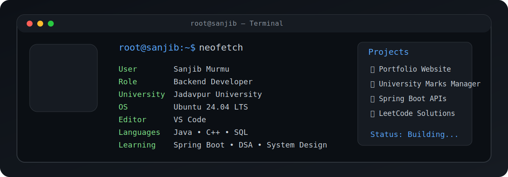

<div align="center">



</div>

```terminal
root@sanjib:~$ whoami
Sanjib Murmu | Backend Developer @ Jadavpur University
B.Tech Information Technology

root@sanjib:~$ cat about.txt
Passionate Backend Engineer focused on building scalable systems. 
Currently optimizing architectures with Java, Spring Boot, and MySQL.
Aiming for Summer Internship 2027.

root@sanjib:~$ tree skills/
skills/
├── Languages
│   └── Java, Python, SQL
├── Backend
│   └── Spring Boot, Hibernate, RESTful APIs
├── Databases
│   └── MySQL, PostgreSQL, Redis
└── Dev Tools
    └── Git, Docker, Linux, VS Code

root@sanjib:~$ ls projects/
├── E-Commerce-API   # Microservices-based backend
├── Task-Scheduler   # Distributed task management
└── Portfolio-OS     # This profile interface

root@sanjib:~$ git stats --user=SanjibMurmu


root@sanjib:~$ ping social/
- LinkedIn: /in/SanjibMurmu
- Email: sanjib.dev@email.com

root@sanjib:~$ cat activity.log


root@sanjib:~$ exit
